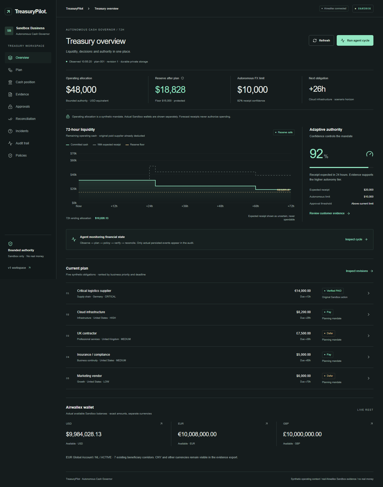

# TreasuryPilot — Autonomous Cash Governor

**Treasury that acts, and knows when to stop.**

[Live cockpit](https://treasurypilot-sooty.vercel.app/treasury) · [Preserved v1](https://treasurypilot-sooty.vercel.app/treasury/v1) · [Source](https://github.com/ect2000/treasurypilot/tree/agentic-banking-2026) · [Demo script](docs/demo-script.md)



## Problem and product

A treasury operator must meet obligations, place cash by currency, preserve a reserve and investigate uncertain payments. A wallet balance or model recommendation does not establish spending permission.

TreasuryPilot combines real **Airwallex Sandbox** balances and resources with five explicitly synthetic obligations and a 72-hour operating plan. Company policy bounds authority independently of the model. Reviewed evidence changes confidence and approval requirements. Reconciliation compares recorded instructions with provider readback; incidents investigate the original payment before considering a replacement.

The operating mandate is **USD 48,000**, with a **USD 15,000 reserve**. The previously settled EUR 8,000 receipt can add at most USD 8,000 equivalent to a persisted plan, once. Forecast cash adds no authority. Actual multimillion Sandbox wallets appear separately.

## v1 and v2

v1 supplied the Sandbox adapter, free-only interpretation, deterministic planner, exact encrypted approval controls and **all three recorded financial mutations**, dated 3 October. Its UI remains at /treasury/v1.

v2 adds a server-owned financial world, durable plans and approvals, material context fingerprints, selective reopening, expected/observed/variance reconciliation, currency placement, incident investigation, typed tools, revision locks and permanent global operation claims. The new cockpit has nine functional sections, meaningful charts, responsive inspectors and reduced-motion support. [Baseline](docs/hackathon/BASELINE.md) and [work provenance](docs/hackathon/NEW_WORK.md) record actual dates and commits.

| Pre-existing Sandbox operation | Verified result                                               |
| ------------------------------ | ------------------------------------------------------------- |
| FX                             | USD 15,971.87 → EUR 14,000; SETTLED                           |
| Supplier transfer              | EUR 14,000; PAID through explicit Sandbox state simulation    |
| Customer deposit               | EUR 8,000; SETTLED; historical wallet 10,000,000 → 10,008,000 |

v2 reads their original IDs; it never repeats them or invents approvals. PAID is a Sandbox state, not proof of real bank settlement. [Original financial proof](docs/evidence/financial-actions.json), [deposit proof](docs/evidence/deposit-action.json), [v2 evidence](docs/evidence/v2/README.md).

## Agent loop and architecture

Observe → normalize → plan → policy → exact approval boundary → verify → reconcile → replan.

The server chooses the next permitted step from observed financial state. A visible-page timer runs provider observation every 60 seconds; it never sends a timed financial write. The tools-free model extracts untrusted facts. Deterministic code owns arithmetic, policy and authorization.

Private Vercel Blob stores the aggregate with strong ETag conditional writes. Compression is disabled for version reads; weak versions stop actions. Missing deployed storage fails closed. Local development can use complete immutable revisions under ignored .operator/governor. Financial operation claims remain global across browser workspaces.

[Architecture](docs/architecture.md) · [Agent loop](docs/agent-loop.md) · [Policy](docs/policy-engine.md) · [Reconciliation](docs/reconciliation.md) · [Airwallex integration](docs/airwallex-integration.md)

## Demo

1. Inspect real balances, five obligations and the 72-hour forecast.
2. Interpret and accept the reviewed five-day customer delay: confidence 92% → 31%, autonomy USD 10,000 → 2,500, three decisions reopened.
3. Inspect approval requirements and the reserve refusal.
4. Inspect historical before/deposit/after; **Allocate verified receipt & replan** assigns authority without changing the wallet.
5. Only the contractor reopens from ESCALATE to CONVERT_AND_PAY; four evaluations retain identity and timestamps.
6. Inspect currency placement, reserve, four reconciliation matches and the original payment incident.
7. Export the durable audit.

Additional obligations remain planning-only. The contractor proposal still needs approval and cannot execute through the completed supplier campaign. Current reserve uses current indicative rates; the historical USD 17,025.12 valuation is not presented as today's calculation.

The final public verification on 6 October at 08:55 UTC recorded **USD 16,999.53** remaining planned reserve, one reopened decision, four unchanged decisions and four reconciliation matches, with zero new banking mutations. The forward forecast already deducts the paid supplier from opening cash. [Deployment and validation evidence](docs/evidence/v2/deployment.json).

The [4:40 recording plan](docs/demo-script.md) reuses clearly dated original approval/financial footage. Free inference or deterministic fallback is labelled truthfully.

## Setup and deployment

Node 24.x; Next.js 16.3.8, React 19.3, TypeScript, Tailwind 4, Radix, Motion, Lucide, Recharts, Zod, decimal.js, Vitest and Playwright.

```sh
npm ci
npm run dev
```

Create ignored .env.local from .env.example using a local secret manager. Never paste credentials into chat, source or browser forms.

| Variable                                | Requirement                                              |
| --------------------------------------- | -------------------------------------------------------- |
| AIRWALLEX_BASE_URL                      | Exactly https://api.sandbox.airwallex.com                |
| AIRWALLEX_CLIENT_ID / AIRWALLEX_API_KEY | Scoped Sandbox credentials, server only                  |
| AUTHORIZATION_SECRET                    | Random server secret, at least 32 characters             |
| OPENROUTER_API_KEY                      | Optional existing credential; zero-priced inference only |
| LLM_MODEL / LLM_FALLBACK_MODEL          | Allowlisted free variants; pricing checked at runtime    |
| BLOB_READ_WRITE_TOKEN                   | Private Blob credential; mandatory on Vercel             |
| EXECUTION_CAMPAIGN                      | Existing stable identity; never reset for a recording    |
| EXECUTION_ENABLED_UNTIL                 | Explicit short cutoff; missing/expired disables writes   |
| DEPOSIT_OPERATOR_ENABLED                | Local operator only; never enable on Vercel              |

Link the existing Vercel project, provision private Blob, configure server variables and deploy with `vercel deploy --prod --yes`. CLI deployment does not depend on GitHub automatic deployments. The hosting environment called Production still connects exclusively to **Airwallex Sandbox**.

## Validation and limits

```sh
npm run test
npm run test:e2e
npm run lint
npm run typecheck
npm run build
npm run verify:governor
```

For deployed verification set VERIFY_URL to the live site. The script blocks financial execution commands and checks actual reads, persistence, unchanged decisions, reserve, reconciliation, seven widths, console errors and rejected stale/forged commands. Fixture tests are separate from live evidence. Do not rerun financial/deposit scripts or reset IDs to test deployment.

[Validation](docs/validation.md) · [Security and limits](docs/security-and-limitations.md) · [Design](docs/design-system.md) · [UX rationale](docs/ux-rationale.md).

Only the fixed supplier campaign can execute. Other invoices and placement proposals are planning-only. There is no production banking, authenticated treasury SaaS, automatic replacement transfer, ERP connection or signed webhook integration.

v1 and this 6 October preparation predate the official 25 October build start. Pre-existing-work eligibility remains unverified. The official video limit is under five minutes. No application, organizer message or final submission has been sent. [Official source check](docs/hackathon-analysis.md). MIT license.
