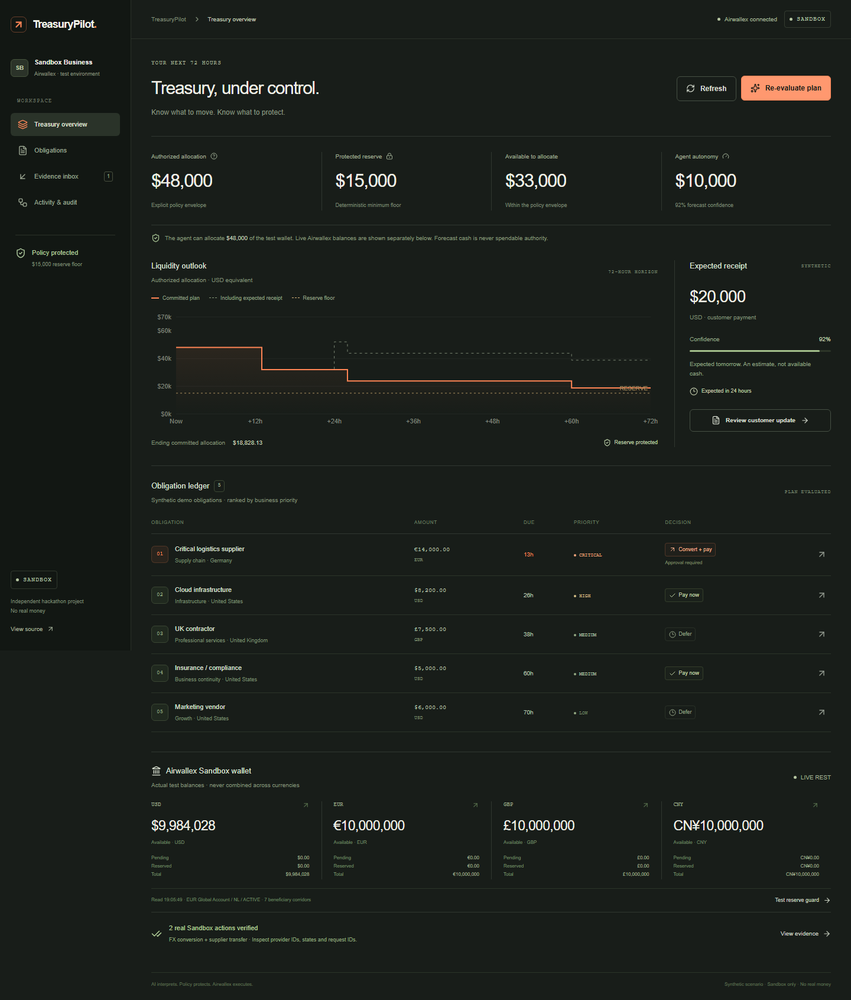

# TreasuryPilot

**Adaptive treasury that knows what to pay, convert, defer or escalate.**

AI interprets the situation. Policy protects liquidity. Airwallex executes.

[Live workspace](https://treasurypilot-sooty.vercel.app/treasury) · [Public source](https://github.com/ect2000/treasurypilot) · [Submission draft](docs/submission.md) · [Demo narration](docs/demo-video-script.md)



## Problem and solution

A finance operator needs to decide which obligation matters next, which currency to acquire, which payment can wait and when uncertainty requires human judgment. A wallet balance or a generic chat response is insufficient.

TreasuryPilot connects a genuine Airwallex **Sandbox** account to a deterministic treasury controller. Five synthetic obligations form a 72-hour scenario. An explicit **$48,000 operating allocation** and **$15,000 reserve** define agent authority. The live test wallet remains visible, even when it contains millions. We neither falsify those balances nor treat all test liquidity as permission to spend.

## Demo and verified financial evidence

1. Open the workspace and inspect actual USD, EUR, GBP and CNY balances, each separately.
2. Build the plan. Inspect the critical supplier's amount, reasoning, reserve effect and dependencies.
3. Open Evidence inbox, interpret the customer delay email with the free model, review the candidate and accept it.
4. Return to the overview: confidence moves 92% → 31%; autonomy moves $10,000 → $2,500; three decisions reopen and two remain unchanged in the baseline delay scenario.
5. Test the reserve guard: a hypothetical $34,200 commitment would leave $13,800. It is blocked without calling a financial endpoint.
6. Inspect Activity & audit and export JSON. The fixed campaign has already executed genuine financial actions; refreshing or visiting again must not duplicate them.

| Real Sandbox operation | Verified evidence                                                                                    |
| ---------------------- | ---------------------------------------------------------------------------------------------------- |
| FX conversion          | USD **15,971.87** → EUR **14,000**, **SETTLED**; `1878f1df-3b32-4d92-8b1e-9bbd83287e4d`              |
| Supplier transfer      | EUR **14,000**, initially **PROCESSING**; `9ad1dd38-ae3b-49bd-961b-ed0adfda7049`                     |
| State simulation       | Actual Sandbox transition requests to **SENT**, then **PAID**, followed by transfer GET verification |

PAID is a **simulated Sandbox state**, not a claim of real bank settlement. See [verification](docs/airwallex-verification.md) and [machine-readable evidence](docs/evidence/financial-actions.json). JSON money is integer minor units; Airwallex REST requests use **major units**. Genuine quote and exact-approval screenshots were captured before the conversion. No new request ID was generated after its initial response failed local parsing.

## How it works / adaptive treasury loop

Evidence → interpreted fact candidate → reviewed state update → deterministic priority and liquidity calculation → reserve/autonomy gate → exact human approval → Airwallex Sandbox action → fresh state and audit.

The scenario is clearly synthetic:

| Obligation                  | Amount     | Due | Priority |
| --------------------------- | ---------- | --- | -------- |
| Critical logistics supplier | EUR 14,000 | 13h | CRITICAL |
| Cloud infrastructure        | USD 8,200  | 26h | HIGH     |
| UK contractor               | GBP 7,500  | 38h | MEDIUM   |
| Insurance / compliance      | USD 5,000  | 60h | MEDIUM   |
| Marketing vendor            | USD 6,000  | 70h | LOW      |

The plan sorts by priority and deadline, evaluates costs in USD using normalized live indicative rates, and uses the actual settled supplier funding cost once available. Funded commitments are deducted sequentially; forecasts never increase current execution authority. A funded foreign-currency obligation proposes `CONVERT_AND_PAY`; funded USD contracts propose `PAY_NOW`; a forecast-dependent shortfall proposes `DEFER` when a high-confidence timely receipt exists, otherwise `ESCALATE`. Discretionary marketing remains deferred.

## Airwallex integration

REST is the primary integration path. The server client authenticates once per warm instance, coalesces concurrent login requests and caches the token until one minute before expiry. It pins API version 2026-08-21, validates payloads with Zod, rounds with decimal.js, rejects redirects and permits only the exact Sandbox origin.

Actual calls: authentication, balances, Global Account list, existing beneficiary list, indicative rates, guaranteed quote create/retrieve, conversion create/list, transfer validate/create/list/retrieve and transfer-state simulation. There was already an active Netherlands EUR Global Account and seven beneficiary corridors. **No new Global Account or beneficiary was needed.** No extra Starter Kit 1 permission was required.

Docs MCP was available and used for public guidance. Developer MCP returned HTTP 401 and needs separate OAuth; it remains optional and does not block the product. Deposit simulation is documented and enabled in the account scope but is not executed or implemented as a public demo action.

## AI usage

The tools-free interpreter sends only the user-submitted document text to OpenRouter. It returns a strictly validated summary, reported receipt delay or invoice candidate, and an instruction-attempt flag. It cannot specify policy limits, beneficiaries, approvals or execution. Imported invoices enter planning only after review.

The live check used **`nvidia/nemotron-3-super-120b-a12b:free`**. Only that model and **`openrouter/free`** are allowed. The current catalog must confirm zero prices; the request sets zero provider price ceilings and disables provider fallback. No paid inference is permitted. If free inference fails, the interface explicitly identifies `DETERMINISTIC_FALLBACK`; it never claims a model call occurred.

## Policy engine, confidence and adaptive autonomy

Policy values are source-controlled constants in `lib/treasury.ts`, not model output:

| Confidence | Autonomy limit |
| ---------- | -------------- |
| ≥ 85%      | $10,000        |
| ≥ 60%      | $5,000         |
| < 60%      | $2,500         |

The reviewed five-day delay deterministically changes confidence to 31% and pushes receipt timing outside the horizon. The reserve floor stays $15,000. An action above autonomy requires exact approval. Any action violating the reserve or campaign cap is rejected even with approval.

## Incremental replanning

Every decision has semantic dependencies, an input signature, evaluation timestamp and revision. Re-evaluation compares signatures and preserves the actual object identity/timestamp when unaffected. The baseline delay reopens cloud and insurance approval requirements plus the contractor's action, while logistics and marketing remain unchanged. Counts come from calculations. FX changes can propagate to later liquidity-dependent decisions; they are not artificially constrained to a fixed demo count.

## Human approval and security

An exact server proposal binds the operation, obligation, quote, amount, currency, full beneficiary hash, wallet hash, forecast, state revision, reserve, campaign and request ID. An AES-GCM sealed five-minute approval conceals those fields and detects tampering. The user confirms the exact Sandbox action. The server re-reads live state and recomputes the deterministic gate before execution. Client-supplied PASS or arbitrary amounts are not accepted.

To make a public demo financially bounded without a database, **only one fixed critical-supplier lifecycle** can execute: EUR 14,000 bought for at most USD 18,000 and one EUR 14,000 local transfer. All visitors share the campaign's stable request IDs. Existing provider results and duplicate-ID protection prevent replayed financial spending. Other obligations demonstrate planning and approval requirements but do not expose arbitrary payouts. Conversion and transfer are a single allocation commitment, counted once.

Secrets are server-only and ignored by Git. Public evidence includes provider operation IDs but no client ID, API key, bearer token, recipient identifier or bank details. See [security and practical limitations](docs/security-and-limitations.md). No authentication, multi-tenant SaaS, ERP or production banking has been added.

## Architecture

```mermaid
flowchart LR
  E[Untrusted invoice / email] --> L[Free-only OpenRouter interpreter]
  L --> C[Validated candidate + user review]
  C --> F[Sealed forecast revision]
  B[Live Airwallex balances / rates] --> T[Deterministic treasury engine]
  F --> T
  T --> P[Reserve + autonomy policy]
  P --> Q[Fixed supplier quote / transfer proposal]
  Q --> H[Exact human approval]
  H --> G[Server live-state recheck]
  G --> FX[Airwallex Sandbox FX]
  FX --> TR[Airwallex Sandbox transfer]
  TR --> AU[Provider evidence + local audit]
  AU --> B
```



No database is needed for the fixed demonstration. Request/session state lives in sealed short-lived tokens; browser-local audit records are exportable. Airwallex is the durable financial source of truth. This does not claim to be a general ledger or exactly-once payment infrastructure.

## Screenshots and tech stack

[Screenshot pack](docs/screenshots/README.md): ten 1440px desktop views plus 1024px and 390px captures. The interface uses a restrained charcoal/orange workspace, a code-native animated liquidity graphic, a responsive obligation ledger, timeline and accessible Radix inspector. Reduced motion is honored.

Next.js 16.3.8 App Router, React 19.3, TypeScript, Tailwind 4, Radix/shadcn-style dialog primitive, Motion, Lucide, Recharts, React Hook Form, Zod, decimal.js, Vitest, Playwright and Vercel.

## Run locally and environment variables

Node 24.x and npm. Clone, install, then configure an ignored `.env.local` from `.env.example` using a local secret store:

```sh
npm ci
npm run dev
```

Open `http://127.0.0.1:3000`.

| Variable                                    | Purpose                                                                  |
| ------------------------------------------- | ------------------------------------------------------------------------ |
| `AIRWALLEX_BASE_URL`                        | Must equal `https://api.sandbox.airwallex.com` exactly                   |
| `AIRWALLEX_CLIENT_ID` / `AIRWALLEX_API_KEY` | Scoped Sandbox credentials, server only                                  |
| `OPENROUTER_API_KEY`                        | Existing OpenRouter credential; free-only inference                      |
| `LLM_MODEL`                                 | `nvidia/nemotron-3-super-120b-a12b:free`                                 |
| `LLM_FALLBACK_MODEL`                        | `openrouter/free`                                                        |
| `AUTHORIZATION_SECRET`                      | Random server secret, at least 32 characters                             |
| `EXECUTION_CAMPAIGN`                        | Stable unique operator campaign, never per-click or per-retry            |
| `EXECUTION_ENABLED_UNTIL`                   | Explicit short ISO timestamp cutoff; absent/invalid/past disables writes |

Do not paste credentials into issues, commits or browser forms. Keep the execution window within seven days of the campaign's first transfer; do not extend it to bypass duplicate protection. The deployed campaign was bounded to 9 October 2026. Financial execution is disabled when the cutoff expires; read and planning capabilities remain.

## Testing

```sh
npm run test
npm run lint
npm run typecheck
npm run build
npx playwright install chromium
npm run test:e2e
npm run test:live
```

Vitest covers money precision, reserve enforcement, deterministic autonomy, priority/defer/escalate behavior, semantic replanning, exact approval, token tampering, stable IDs, prompt-injection handling, Sandbox origin and same-origin proxy checks, token caching and response adapters. Playwright uses explicitly isolated test fixtures and covers the plan, inspector, approval checkbox, reserve block, evidence/replan and responsive navigation at three widths. Fixture tests are not claimed as live financial evidence.

`test:live` performs genuine Sandbox reads, creates a non-financial FX quote and makes a real free OpenRouter call. `validate:financial` is an explicit operator command that may create the fixed financial campaign after authorization gates; it is never run by tests/build/deployment and reuses existing operation IDs. `scripts/capture-live.ts` captures real browser state and may execute that campaign with the owner's authorization. Never reset IDs to make tests repeat spending.

Production dependency audit: zero vulnerabilities with `npm audit --omit=dev`. Five development-only linter advisory paths remain with no compatible patched registry release; their exact scope is documented in security limitations.

## Deployment

Deploy to Vercel with the server variables configured in Production and Node 24.x. The project was linked and deployed using the existing authenticated Vercel CLI. No database or hosting outside Vercel is required. CLI deployments do not depend on the GitHub repository's automatic deployment connection.

```sh
vercel link
# Configure the variables using Vercel's secret/environment UI or CLI stdin.
vercel --prod
```

Never prefix banking variables with `NEXT_PUBLIC_`. Verify the deployed live balances and free inference after deployment. Do not replay the already completed campaign to test a redeployment.

## Limitations and future work

Only the critical supplier executes; other obligations are planning demonstrations. No webhook feed, durable audit database, global approval revocation, independent operator login or invoice verification is implemented. Browser history is local. Indicative rates differ from guaranteed quotes; settled supplier funding is reconciled into subsequent plans. PAID was explicitly simulated. Formal hackathon eligibility/build-window/submission rules were not verified and must be checked before submission.

Useful next steps: atomic durable reservations for multiple actions, a durable approval/idempotency ledger, authorized operators, fee-aware payouts and signed webhook reconciliation. See [competition analysis](docs/hackathon-analysis.md), [submission copy](docs/submission.md) and the [2:50 narration](docs/demo-video-script.md).

## Hackathon and license

New independent solo project for the Airwallex Agentic Banking Hackathon, Starter Kit 1. Sandbox only. No real money. MIT license; formal competition requirements remain pending verification.
