# Architecture

Airwallex Sandbox is the financial source of truth. The server aggregate stores observed context, policy, plans, approvals, reconciliation, incidents and audit. Browser state selects a tab or inspector; it does not calculate financial authority.

```mermaid
flowchart TD
  B[Airwallex Sandbox reads] --> W[Normalized financial world]
  S[Synthetic obligations and forecast] --> W
  E[Untrusted customer text] --> L[Tools-free interpreter]
  L --> H[Validated facts and human review]
  H --> W
  W --> P[Deterministic plan and policy]
  P --> A[Exact approval intent]
  A --> X[Revision lock and permanent claim]
  X --> F[Fixed Sandbox execution adapter]
  F --> B
  B --> R[Expected / observed / variance]
  R --> P
  R --> I[Incident investigation]
  W --> D[Private durable aggregate]
  D --> U[Treasury cockpit]
```

lib/governor/types.ts defines the model; engine.ts calculates authority, selective plans, placement and reconciliation. lib/server/governor.ts validates tools and coordinates state; governor-store.ts supplies compare-and-swap persistence; authorization.ts and airwallex.ts preserve execution controls.

Private Blob reads bypass cache and compression to obtain strong ETags. Concurrent writes return HTTP 409. Local revision files publish complete JSON atomically via an exclusive hard link. A sealed HTTP-only cookie identifies application context; financial operation IDs remain global. Public views remove sealed proposals/approvals.

FinanceContextProvider separates synthetic forecast context from a future accounting adapter. No accounting connector or webhook worker is claimed.
