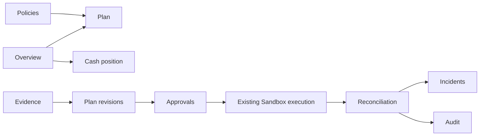

# UX and visual information architecture

Visual thesis: calm ink surfaces, warm white figures and a precise mint accent; institutional density with generous separation between decisions and evidence.

Content plan: enter the cockpit directly; lead with bounded liquidity, reserve, authority and next decision; support with the 72-hour projection and three currency positions; detail in a focused inspector; close with provider evidence and reconciliation.

Interaction thesis: a short confidence-to-authority transition explains policy changes; changed decision rows enter while preserved rows retain identity; actual persisted agent phases and reconciliation events appear in a timeline. Reduced motion removes these transitions.

Desktop: persistent slim navigation; central financial workspace; right context pane where needed. Mobile: reserve/authority before charts; compact plan rows and approval drawer; a deliberate navigation menu; no endless repeated dashboard widgets. Every chart has an accessible text equivalent, deterministic inputs, exact monetary tooltip and source label. Synthetic operating allocation and genuine wallet balances remain visibly distinct.
